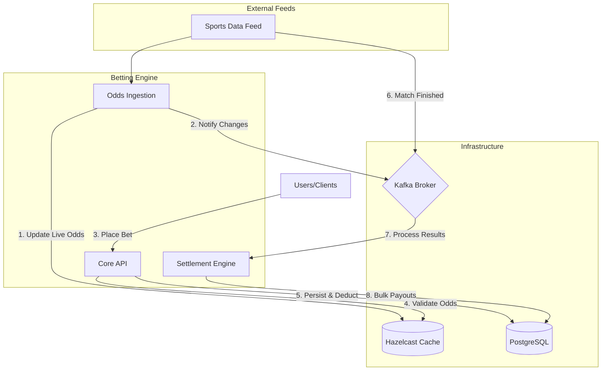

# Sportingtech Betting Engine

A high-performance, multi-tenant betting platform built with Java 21, Spring Boot 3.2, and a modern distributed infrastructure. This project demonstrates a robust architecture for handling live odds ingestion, real-time bet validation, and high-throughput settlement.

## 🏗️ Architecture

The system is composed of three primary microservices interacting through a combination of high-speed distributed caching (Hazelcast) and asynchronous messaging (Kafka).



## 🚀 Key Modules

### [core](./core)
The central nervous system of the engine.
- **Responsibilities**: Bet placement, wallet management, user authentication (JWT), and multi-tenancy.
- **Concurrency**: Uses a combination of JVM-level `ReentrantLock` for user serialization and JPA Optimistic Locking (`@Version`) for data integrity.
- **Multi-Tenancy**: Implements schema-based or logical isolation via `TenantContext` and specialized Hibernate filters.

### [odds-ingestion](./odds-ingestion)
Handles the high-velocity ingestion of live match data.
- **Responsibilities**: Simulates/Ingests sports feeds, updates the global `match-odds-map` in Hazelcast.
- **Performance**: Optimized for low-latency updates to ensure the `core` API always validates bets against the latest market prices.

### [settlement](./settlement)
A specialized engine for high-throughput match settlement.
- **Responsibilities**: Listens for `match-finished` events and performs atomic bulk updates.
- **Performance**: Skips ORM overhead by using direct `JdbcTemplate` calls for mass payouts, ensuring thousands of bets can be settled in milliseconds without JVM memory exhaustion.

## 🛠️ Technology Stack

- **Runtime**: Java 21
- **Framework**: Spring Boot 3.2.4
- **Database**: PostgreSQL 16 (Relational storage for bets, wallets, and users)
- **Cache**: Hazelcast 5.3 (Distributed IMDG for real-time odds validation)
- **Messaging**: Kafka (Asynchronous event-driven communication)
- **Security**: Spring Security + JSON Web Tokens (JWT)
- **Testing**: JUnit 5, Mockito, and **Testcontainers** (for real integration testing with Postgres/Kafka)

## 🚦 Getting Started

### Prerequisites
- **Java 21** or higher.
- **Maven 3.9+**.
- **Docker & Docker Compose**.

### 1. Spin up Infrastructure
Use the provided `docker-compose.yml` to start PostgreSQL, Kafka, and Hazelcast:
```bash
docker-compose up -d
```

### 2. Build the Project
From the root directory, run:
```bash
./mvnw clean install
```

### 3. Run the Services
You can start the services individually using Maven or your IDE:
- **Core**: `mvn -pl core spring-boot:run`
- **Odds Ingestion**: `mvn -pl odds-ingestion spring-boot:run`
- **Settlement**: `mvn -pl settlement spring-boot:run`

## 🧪 Testing
The project includes comprehensive unit and integration tests. Integration tests leverage **Testcontainers** to spin up real instances of PostgreSQL and Kafka during the build.

To run all tests:
```bash
./mvnw test
```

## 📝 Multi-Tenancy Design
This engine is built to support multiple operators (tenants) on a single infrastructure. Each request is scoped to a `tenantId` (extracted from JWT or Headers), ensuring data isolation at the repository level via automated Hibernate filters.
