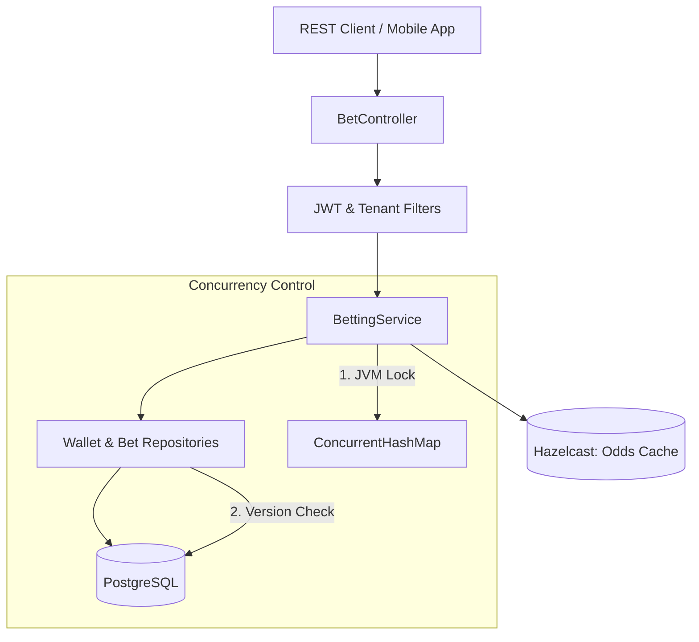

# 🎯 Betting Engine: Core Module

The **Core Module** is the central nervous system of the Betting Engine. It manages the mission-critical business logic for user wallets, bet placement, and tenant isolation using a high-performance, consistent architecture.

---

## 🚀 Key Features

- **Multi-Tenant Isolation**: Native support for multiple operators (tenants) using Hibernate Filters and AOP.
- **Micro-second Validation**: Distributed odds validation via Hazelcast before any DB transaction occurs.
- **Fail-Safe Integrity**: Combined JVM-level `ReentrantLock` and Database-level Optimistic Locking to prevent double-spending.
- **Stateless Security**: JWT-based authentication with tenant-context propagation.

---

## 🏗️ Architecture

The module follows a strict **3-Tier Layered Architecture** with cross-cutting concerns handled by Spring AOP.



---

## 🛠️ Technology Stack

| Technology | Purpose | Implementation Detail |
| :--- | :--- | :--- |
| **Java 21/25** | Runtime | Modern language features (Records, Pattern Matching) |
| **Spring Boot 3.2** | Framework | Core orchestration and dependency injection |
| **Hibernate 6** | ORM | Advanced data mapping with dynamic @Filters |
| **Hazelcast 5** | Distributed Map | Ultra-low latency reads for live odds validation |
| **PostgreSQL 16** | Persistence | ACID compliant relational storage |
| **JJWT** | Security | Stateless authentication and tenant identification |

---

## 🔄 The "Golden Path" (Bet Placement Workflow)

When a user places a bet, the system executes the following atomic sequence in `BettingService.java`:

1.  **Identity & Context**: Extracts the `tenantId` and `userId` from the secure context.
2.  **Per-User Serialization**: Acquires a `ReentrantLock` specific to the `userId`. This prevents the "Race to the Bottom" where the same user clicks 'Bet' 10 times simultaneously.
3.  **NoSQL Pre-Check**: Queries the Hazelcast `match-odds-map`. If the odds changed while the user was thinking, the request is rejected *before* hitting the database.
4.  **Wallet Deduction**: 
    - Loads the `Wallet` entity from PostgreSQL.
    - Decrements balance.
    - Saves back to DB (Hibernate checks `@Version` to ensure no other thread updated it).
5.  **Audit Trail**: Records the `Bet` entity with the frozen odds and stake.

---

## 📁 Project Structure

| Package | Responsibility |
| :--- | :--- |
| `com.betting.core.controller` | REST Endpoints (Internal/External) |
| `com.betting.core.domain` | JPA Entities (@Filters, @Version, Enums) |
| `com.betting.core.service` | Core transactional logic and locking |
| `com.betting.core.infra.tenant` | Multi-tenancy AOP and ThreadLocal context |
| `com.betting.core.infra.security` | JWT Filters and Security Configurations |
| `com.betting.core.infra.exception` | ProblemDetails based global error handling |

---

## ⚙️ Configuration & Environment

The service can be tuned via `application.properties` or environment variables:

| Property | Env Var | Description | Default |
| :--- | :--- | :--- | :--- |
| `spring.datasource.url` | `SPRING_DATASOURCE_URL` | DB Connection String | `jdbc:postgresql://localhost:5432/db` |
| `hazelcast.network.cluster-members` | `HAZELCAST_NETWORK_CLUSTER_MEMBERS` | Hazelcast discovery list | `localhost:5701` |
| `jwt.secret` | `JWT_SECRET` | HS256 Signing Key | `change-it-in-prod` |

---

## 🛠️ Getting Started

### Prerequisites
- JDK 21+
- Maven 3.9+
- Running PostgreSQL & Hazelcast (via Root `docker-compose.yml`)

### Build & Run
```bash
mvn clean package -DskipTests
java -jar target/core-0.0.1-SNAPSHOT.jar
```
