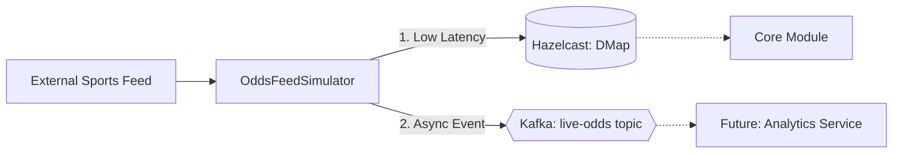

# 📊 Betting Engine: Odds Ingestion Module

The **Odds Ingestion Module** is a high-throughput ETL (Extract, Transform, Load) microservice. It acts as the gateway for external sports data feeds, transforming raw volatility into structured, actionable insights for the entire ecosystem.

---

## 🚀 Key Features

- **Real-Time Data Simulation**: High-fidelity simulation of external XML/JSON sports feeds with sub-second volatility.
- **Dual-Channel Broadcast**: Simultaneous update to a low-latency distributed cache (Hazelcast) and a persistent message broker (Kafka).
- **Asynchronous Decoupling**: Ensures that temporary downstream slow-downs (e.g., in Settlement) do not block the ingestion of fresh data.
- **Scalable Distribution**: Kafka partitioning allows multiple consumers to process odds updates in parallel.

---

## 🏗️ Architecture

The ingestion flow is designed for **maximum uptime** and **zero blocking**.



---

## 🛠️ Technology Stack

| Technology | Purpose | Implementation Detail |
| :--- | :--- | :--- |
| **Java 21/25** | Runtime | Record-based immutable data models |
| **Spring Boot 3** | Framework | Dependency Injection and Scheduling |
| **Spring Kafka** | Messaging | Producer-side abstraction for event broadcasting |
| **Hazelcast 5** | DMap | Global state for real-time REST validation |
| **Jackson XML** | Transform | Fast conversion of external feed formats |

---

## 🔄 The Ingestion Loop

The `OddsFeedSimulator.java` runs a continuous loop (configured via `@Scheduled`):

1.  **Poll**: Simulates fetching the latest scores and odds from a global provider.
2.  **Transform**: Maps external match identifiers and raw values to the internal `MatchOdds` record.
3.  **High-Speed Cache Update**: 
    - Executes `oddsCache.put(id, odds)`.
    - This ensures the **Core Module** can validate a bet against the *current* millisecond price.
4.  **Kafka Broadcast**: 
    - Publishes to the `live-odds` topic.
    - Key: `matchId` (Ensures ordering per match).
    - Value: `MatchOdds` JSON.

---

## 📁 Project Structure

| Package | Responsibility |
| :--- | :--- |
| `com.betting.odds.service` | ETL Ingestion and Simulation logic |
| `com.betting.odds.domain` | Immutable data records (DMap Serializable) |
| `com.betting.odds.config` | Hazelcast and Kafka client configurations |

---

## ⚙️ Configuration & Environment

| Property | Env Var | Description | Default |
| :--- | :--- | :--- | :--- |
| `spring.kafka.bootstrap-servers` | `SPRING_KAFKA_BOOTSTRAP_SERVERS` | Kafka Broker address | `localhost:9092` |
| `hazelcast.network.cluster-members` | `HAZELCAST_NETWORK_CLUSTER_MEMBERS` | Distributed cache discovery | `localhost:5701` |
| `logging.level.com.betting` | `LOGGING_LEVEL_BETTING` | Ingestion verbosity | `INFO` |

---

## 🛠️ Getting Started

### Prerequisites
- JDK 21+
- Kafka & Zookeeper (via Root `docker-compose.yml`)

### Running the Simulator
```bash
mvn clean package -DskipTests
java -jar target/odds-ingestion-0.0.1-SNAPSHOT.jar
```
*Note: Once started, you will see real-time odds updates being logged and published to the cluster.*
