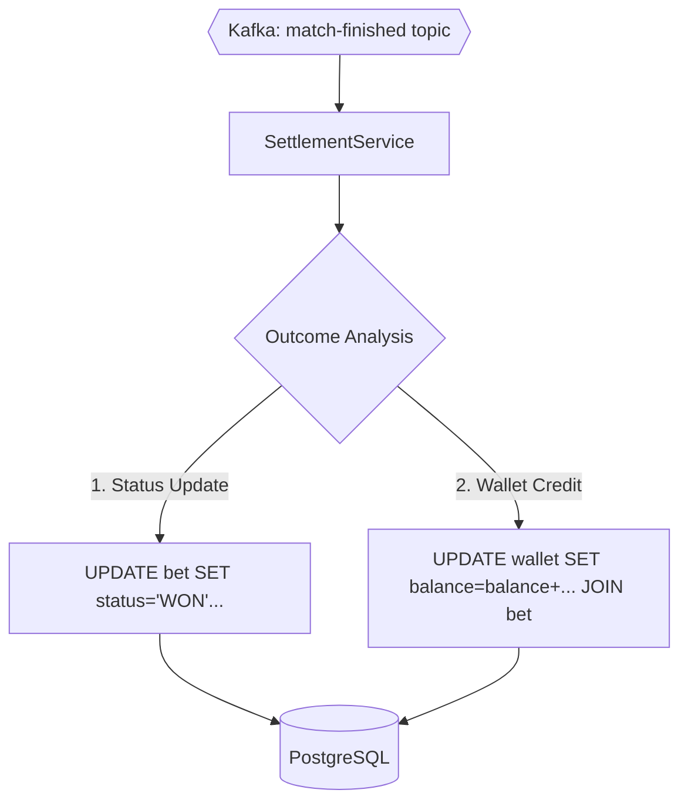

# 💰 Betting Engine: Settlement Module

The **Settlement Module** is the core financial reconciliation service. It is an event-driven consumer designed to process thousands of bets in bulk when a match concludes, ensuring rapid and accurate distribution of winnings.

---

## 🚀 Key Features

- **Massive Parallel Throughput**: Specifically designed to handle peak loads (e.g., end of World Cup matches) without system lag.
- **Atomic Bulk Payouts**: Uses set-based SQL updates instead of record-by-record iteration, reducing database round-trips by 99%.
- **Event-Driven Resilience**: Listens to the `match-finished` Kafka topic, allowing for automatic retries and dead-letter handling.
- **Resource Efficiency**: Zero JPA overhead. Direct `JdbcTemplate` usage prevents the JVM from clogging memory with thousands of Hibernate entities.

---

## 🏗️ Architecture

The settlement engine follows a **reactive-pull model** from the message broker.



---

## 🛠️ Technology Stack

| Technology | Purpose | Implementation Detail |
| :--- | :--- | :--- |
| **Java 21/25** | Runtime | Modern stream-processing and records |
| **Spring Boot 3** | Framework | Lightweight microservice shell |
| **Spring JDBC** | Performance | Direct control over SQL execution plans |
| **Spring Kafka** | Event Bus | Group-based message consumption |
| **PostgreSQL** | Ledger | Consistent transactional storage |

---

## 🔄 The Settlement Flow (Technical Breakdown)

In `SettlementService.java`, the system processes a match conclusion event:

1.  **Event Reception**: Subscribed to `match-finished`. When an event arrives, it carries the `matchId` and the `winningPrediction` (e.g., `HOME_WIN`).
2.  **Bet State Transition**: 
    - Executes an atomic `UPDATE` to flip all matching `PENDING` bets to `WON`.
    - Flips non-matching pending bets to `LOST`.
3.  **The "Big Credit" (Atomic JOIN Update)**:
    - Instead of loading each winner, calculating the payout in Java, and saving back (slow), it runs an **Internal Join Update**:
    ```sql
    UPDATE wallet w
    SET balance = w.balance + (b.stake * b.placed_odds)
    FROM bet b
    WHERE b.wallet_id = w.id
      AND b.match_id = ?
      AND b.prediction = ?
      AND b.status = 'WON'
    ```
    - **Effect**: Credits 10,000 wallets in a single sub-second transaction.

---

## 📁 Project Structure

| Package | Responsibility |
| :--- | :--- |
| `com.betting.settlement.service` | Event listeners and bulk SQL logic |
| `com.betting.settlement.dto` | Inbound event record mappings |
| `com.betting.settlement.config` | JDBC and Kafka Consumer tuning |

---

## ⚙️ Configuration & Environment

| Property | Env Var | Description | Default |
| :--- | :--- | :--- | :--- |
| `spring.kafka.consumer.group-id` | `KAFKA_GROUP_ID` | Settlement consumer group | `settlement-group` |
| `spring.datasource.url` | `SPRING_DATASOURCE_URL` | Postgres Connection String | `jdbc:postgresql://postgres:5432/db` |
| `hikari.maximum-pool-size` | `HIKARI_MAX_POOL` | DB Connection Pool | `20` |

---

## 🛠️ Getting Started

### Prerequisites
- Running PostgreSQL (via Root `docker-compose.yml`)
- Kafka Broker with the `match-finished` topic

### Run the Service
```bash
mvn clean package -DskipTests
java -jar target/settlement-0.0.1-SNAPSHOT.jar
```
